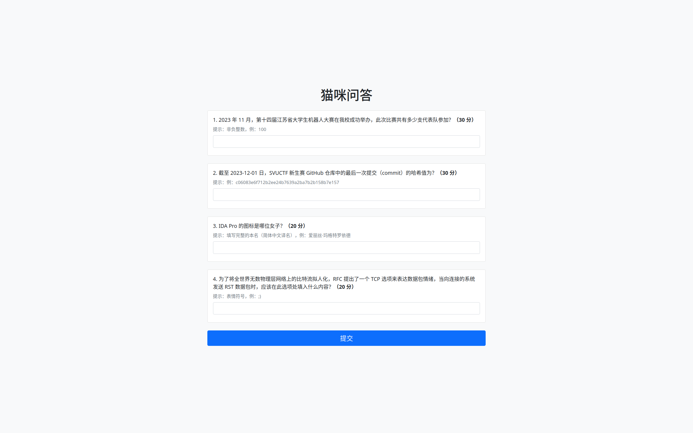
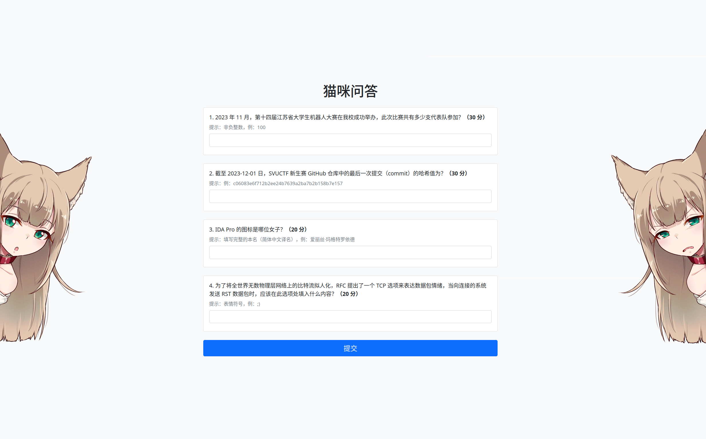

<div align="center">

# NekoQuiz

NekoQuiz 是一个 CTF 问答题通用框架，对 [USTC Hackergame 猫咪问答](https://github.com/USTC-Hackergame/hackergame2023-writeups/blob/master/official/%E7%8C%AB%E5%92%AA%E5%B0%8F%E6%B5%8B/README.md) 的仿制。

Rust 编写，前端使用 [Yew](https://yew.rs/) + [Bootstrap](https://getbootstrap.com/) ，后端使用 [Axum](https://github.com/tokio-rs/axum) ，一键部署至各比赛平台。


[预览](#预览) •
[安装](#安装) •
[配置](#配置) •
[部署](#部署)

</div>

## 预览




## 安装

### 预构建二进制文件

你可以在 [Github release](https://github.com/13m0n4de/neko-quiz/release) 页面找到自动构建的二进制文件，下载对应系统架构的文件解压即可。

### Docker 镜像

```
$ docker pull https://ghcr.io/13m0n4de/neko-quiz/todo:latest
```

### 从源文件构建

如果选择从源文件构建，先要确保拥有 Rust 工具链，并安装 [Trunk](https://github.com/thedodd/trunk)：

```
$ cargo install trunk  # 从源码安装
$ cargo binstall trunk  # 或使用 cargo-binstall 安装二进制文件
```

克隆源代码：

```
$ git clone https://github.com/13m0n4de/neko-quiz/
```

使用 [build.sh](build.sh) 可以快速编译：

```
$ ./build.sh
```

前端文件输出在 `dist/` 后端文件输出在 `target/release/backend`

## 配置

## 部署

## 使用案例 

- [SVUCTF/SVUCTF-WINTER-2023 猫娘问答](https://github.com/SVUCTF/SVUCTF-WINTER-2023/tree/main/challenges/misc/neko_quiz)

## 许可证

该项目采用 MIT 许可证 - 查看 [LICENSE](LICENSE) 文件了解更多细节。

## 相关项目

- [USTC-Hackergame 猫咪小测](https://github.com/USTC-Hackergame/hackergame2023-writeups/blob/master/official/%E7%8C%AB%E5%92%AA%E5%B0%8F%E6%B5%8B/README.md)
- [rksm/axum-yew-setup](https://github.com/rksm/axum-yew-setup/)