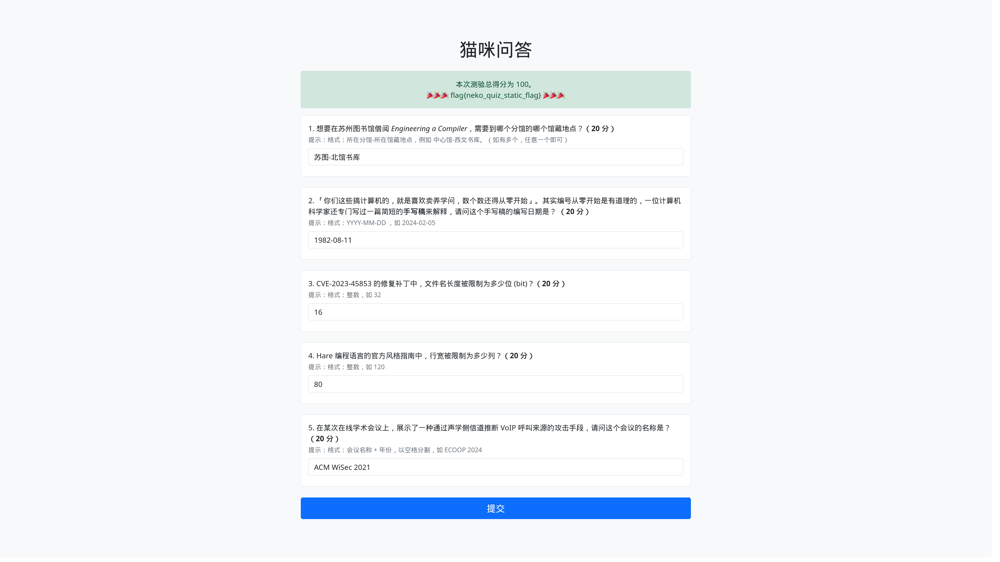

<div align="center">

# NekoQuiz

NekoQuiz 是一个 CTF 问答题通用框架，对 [USTC Hackergame 猫咪问答](https://github.com/USTC-Hackergame/hackergame2023-writeups/blob/master/official/%E7%8C%AB%E5%92%AA%E5%B0%8F%E6%B5%8B/README.md) 的仿制。

Rust 编写，前端使用 [Yew](https://yew.rs/) + [Bootstrap](https://getbootstrap.com/) ，后端使用 [Axum](https://github.com/tokio-rs/axum)。


[预览](#%E9%A2%84%E8%A7%88) •
[特性](#%E7%89%B9%E6%80%A7) •
[安装](#%E5%AE%89%E8%A3%85) •
[配置](#%E9%85%8D%E7%BD%AE) •
[部署](#%E9%83%A8%E7%BD%B2) •
[帮助](#%E5%B8%AE%E5%8A%A9)

</div>

## 预览

在线预览：[https://neko-quiz.shuttleapp.rs/](https://neko-quiz.shuttleapp.rs/)



> \[!WARNING\]
>
> 本项目仍处于开发阶段，可能存在未知的安全隐患和功能缺陷，仅作为实验和学习用途，不建议直接应用于生产环境。

## 特性

- 🛠 **灵活配置**：使用 TOML 文件轻松配置问题、答案和提示
- 🔄 **配置热重载**：支持配置文件热重载，无需重启即可更新问题
- 🔒 **多种 Flag 获取方式**：支持环境变量、文件读取和静态字符串
- 🐳 **Docker 支持**：提供 Docker 镜像和 docker-compose 配置
- 🌐 **跨平台**：提供预构建的多平台二进制文件
- 💬 **自定义消息**：支持 HTML 格式的错误和成功消息

## 安装

### 预构建二进制文件

你可以在 [Releases](https://github.com/13m0n4de/neko-quiz/releases) 页面找到自动构建的二进制文件。

### Docker 镜像

```bash
docker pull ghcr.io/13m0n4de/neko-quiz
```

详细的 Docker 镜像使用说明请参考[部署](#%E9%83%A8%E7%BD%B2)章节。

### 从源代码构建

1. 确保已安装 Rust 工具链
1. 安装 [Trunk](https://github.com/thedodd/trunk)：
    ```bash
    cargo install trunk  # 从源码安装
    cargo binstall trunk  # 或使用 cargo-binstall 安装二进制文件
    ```
1. 克隆仓库：
    ```bash
    git clone https://github.com/13m0n4de/neko-quiz/
    ```
1. 构建项目
    ```bash
    ./scripts/build.sh
    ```

构建完成后，前端文件将输出在 `dist/` 目录，后端可执行文件位于 `target/release/server`。

> \[!NOTE\]
>
> 注意：从源代码构建需要安装额外的依赖，如 wasm32-unknown-unknown 目标。

## 配置

项目根目录有一份配置示例：[config.toml](config.toml)

```toml
title = "猫咪问答"
[[questions]]
text = "想要在苏州图书馆借阅 <i>Engineering a Compiler</i>，需要到哪个分馆的哪个馆藏地点？"
points = 20
hint = "格式：所在分馆-所在馆藏地点，例如 中心馆-西文书库。（如有多个，任意一个即可）"
answers = [ "苏图-北馆书库", "苏图-设计图书馆",]

[[questions]]
text = "「你们这些搞计算机的，就是喜欢卖弄学问，数个数还得从零开始」。其实编号从零开始是有道理的，一位计算机科学家还专门写过一篇简短的<b>手写稿</b>来解释，请问这个手写稿的编写日期是？"
points = 20
hint = "格式：YYYY-MM-DD ，如 2024-02-05"
answers = [ "1982-08-11",]

[[questions]]
text = "CVE-2023-45853 的修复补丁中，文件名长度被限制为多少位 (bit)？"
points = 20
hint = "格式：整数，如 32"
answers = [ "16",]

[[questions]]
text = "Hare 编程语言的官方风格指南中，行宽被限制为多少列？"
points = 20
hint = "格式：整数，如 120"
answers = [ "80",]

[[questions]]
text = "在某次在线学术会议上，展示了一种通过声学侧信道推断 VoIP 呼叫来源的攻击手段，\n请问这个会议的名称是？"
points = 20
hint = "格式：会议名称 + 年份，以空格分割，如 ECOOP 2024"
answers = [ "ACM WiSec 2021", "WiSec 2021",]

[flag]
env = "FLAG"
file = "/flag"
static_str = "flag{neko_quiz_static_flag}"

[message]
incorrect = "没有全部答对，不能给你 FLAG 哦。"
correct = "🎉🎉🎉 $FLAG 🎉🎉🎉"
```

| 配置项         | 子项           | 说明                          | 示例                                                           |
| ----------- | ------------ | --------------------------- | ------------------------------------------------------------ |
| `title`     | -            | 问答标题                        | `"猫咪问答"`                                                     |
| `questions` | -            | 题目列表，可包含多个问题                | (见下方详细说明)                                                    |
|             | `text`       | 问题正文，支持 HTML 标签             | `"想要在苏州图书馆借阅 <i>Engineering a Compiler</i>，需要到哪个分馆的哪个馆藏地点？"` |
|             | `points`     | 问题分数                        | `20`                                                         |
|             | `hint`       | 答题提示，支持 HTML 标签             | `"格式：所在分馆-所在馆藏地点，例如 中心馆-西文书库。（如有多个，任意一个即可）"`                 |
|             | `answers`    | 正确答案列表，可设置多个                | `[ "苏图-北馆书库", "苏图-设计图书馆" ]`                                  |
| `flag`      | -            | Flag 获取方式配置                 | (见下方详细说明)                                                    |
|             | `env`        | 从环境变量获取 Flag                | `"GZCTF_FLAG"`                                               |
|             | `file`       | 从文件获取 Flag                  | `"/flag"`                                                    |
|             | `static_str` | 静态字符串作为 Flag                | `"flag{neko_quiz_static_flag}"`                              |
| `message`   | -            | 返回消息配置                      | (见下方详细说明)                                                    |
|             | `incorrect`  | 回答错误时的消息                    | `"没有全部答对，不能给你 FLAG 哦。"`                                      |
|             | `correct`    | 回答正确时的消息，`$FLAG` 为 Flag 占位符 | `"🎉🎉🎉 $FLAG 🎉🎉🎉"`                                            |

> \[!TIP\]
>
> 注意事项：
>
> 1. `questions` 为列表，可包含多个问题，每个问题都包含 `text`、`points`、`hint` 和 `answers` 字段
> 1. `flag` 配置项按优先级顺序尝试：环境变量 > 文件 > 静态字符串
> 1. 消息配置支持 HTML 标签，可用于自定义样式

## 部署

NekoQuiz 支持多种部署方式，默认端口为 `3000`。请根据您的需求选择合适的部署方法。

### 预构建二进制文件

如果从是 [Releases](https://github.com/13m0n4de/neko-quiz/releases) 下载的压缩包，解压所有文件到同一目录并运行 `neko-quiz` 即可。

1. 解压下载的压缩包：
    ```bash
    tar xvf x86_64-unknown-linux-musl.tar.gz
    ```
1. 运行可执行文件：
    ```bash
    ./neko-quiz
    ```
    或指定地址和端口：
    ```bash
    ./neko-quiz -a 0.0.0.0:3000
    ```

> \[!NOTE\]
>
> 提示：使用 -h 或 --help 参数查看更多选项，或参考[帮助](#%E5%B8%AE%E5%8A%A9)章节。

### Docker 镜像

确保挂载的配置文件 `config.toml` 路径正确。

- 使用环境变量作为 Flag：
    ```bash
    docker run -d --rm -p 3000:3000 \
        -v ./config.toml:/config.toml \
        -e GZCTF_FLAG='flag{example}' \
        --name neko-quiz ghcr.io/13m0n4de/neko-quiz
    ```
- 使用文件提供 Flag：
    ```bash
    docker run -d --rm -p 3000:3000 \
        -v ./config.toml:/config.toml \
        -v ./flag:/flag \
        --name neko-quiz ghcr.io/13m0n4de/neko-quiz
    ```
- 使用 docker-compose，编辑 docker-compose.yml 文件配置环境变量和文件挂载，然后运行：
    ```bash
    docker-compose up -d
    ```

### 本地开发部署

- 编译并启动 Dev 版本（代码修改自动重新编译）：
    ```bash
    ./scripts/dev.sh
    ```
- 编译并启动 Release 版本：
    ```bash
    ./scripts/prod.sh
    ```
- 或构建本地 Docker 镜像：
    ```bash
    docker build . -t neko-quiz
    docker run -d -p 3000:3000 -v ./config.toml:/config.toml neko-quiz
    ```

## 帮助

### 命令行参数

运行 `neko-quiz --help` 可以查看完整的命令行选项。以下是主要参数的概览：

| 参数             | 简写   | 默认值              | 描述        |
| -------------- | ---- | ---------------- | --------- |
| `--log`        | `-l` | `debug`          | 设置日志级别    |
| `--addr`       | `-a` | `127.0.0.1:3000` | 设置监听地址和端口 |
| `--config`     | `-c` | `config.toml`    | 指定配置文件路径  |
| `--static-dir` |      | `./dist`         | 指定静态文件目录  |
| `--help`       | `-h` |                  | 显示帮助信息    |

## 使用案例

- [SVUCTF/SVUCTF-SPRING-2024 猫咪问答](https://github.com/SVUCTF/SVUCTF-SPRING-2024/tree/main/challenges/misc/neko_quiz)
- [SVUCTF/SVUCTF-WINTER-2023 猫娘问答](https://github.com/SVUCTF/SVUCTF-WINTER-2023/tree/main/challenges/misc/neko_quiz)

## 许可证

该项目采用 MIT 许可证 - 查看 [LICENSE](LICENSE) 文件了解更多细节。

## 相关项目

- [USTC-Hackergame 猫咪小测](https://github.com/USTC-Hackergame/hackergame2023-writeups/blob/master/official/%E7%8C%AB%E5%92%AA%E5%B0%8F%E6%B5%8B/README.md)
- [rksm/axum-yew-setup](https://github.com/rksm/axum-yew-setup/)
